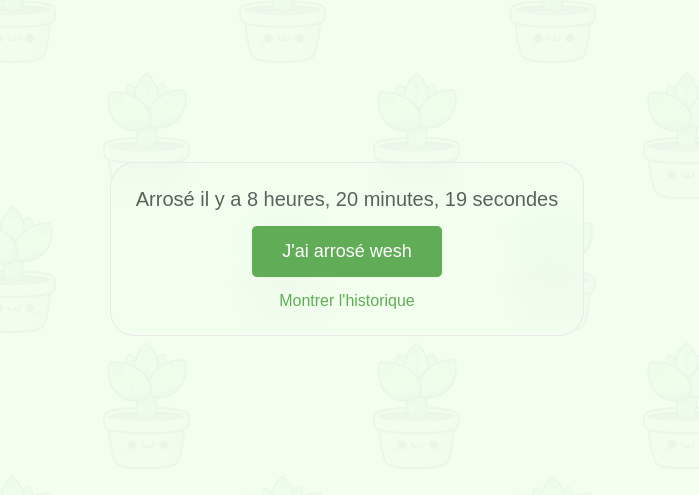

# TinyPlants

Literally only tells you the last time you watered your plants (in French).
Click the button to update.

## Installation

This can be self-hosted easily if you have Rust installed:

```bash
git clone https://github.com/Uriopass/TinyPlants.git
cd TinyPlants
cargo build --release
PORT=8080 ./target/release/tinyplants
```

### Screenshot



### License

The cute background image is from © Daniel J Kuzmenka - http://www.redbubble.com/people/fractalkuzy